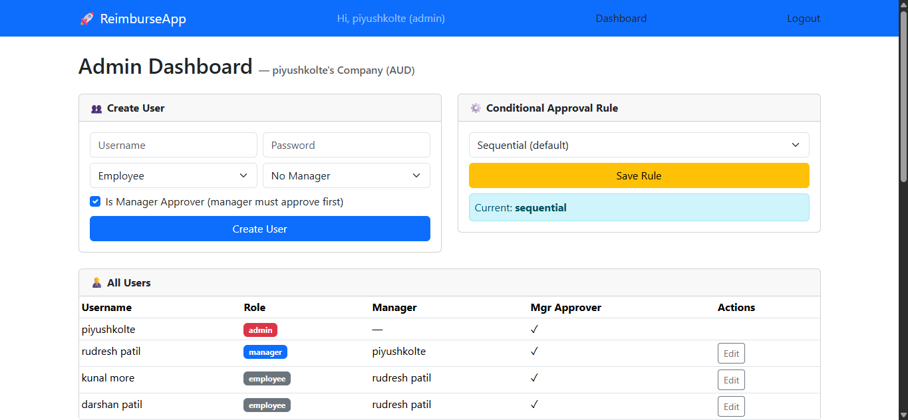
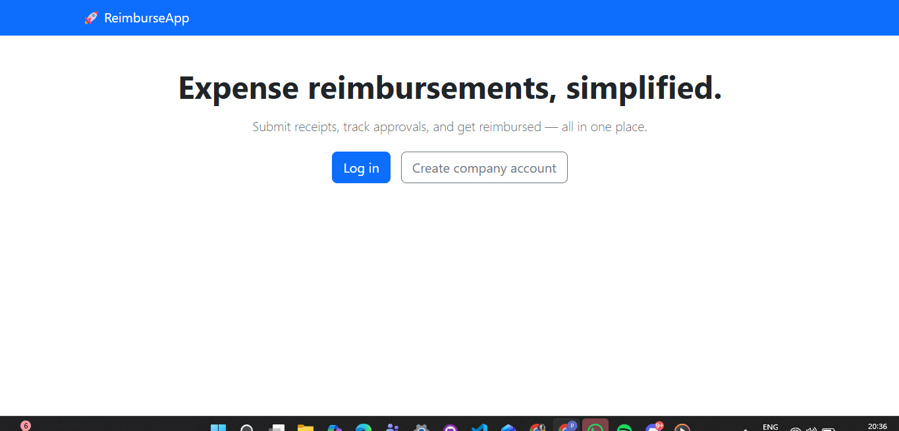
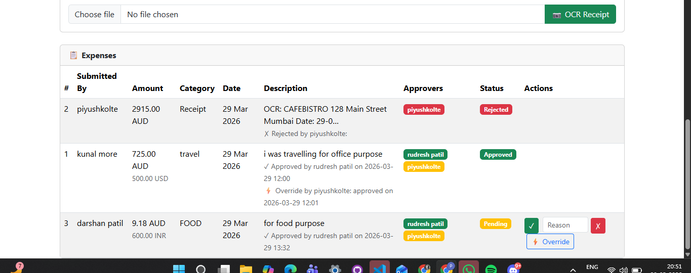

# ReimburseAI 🚀

### Smart rule-based expense reimbursement system with dynamic approval workflows, OCR automation, and multi-currency support

> From receipts to approvals — automated intelligently.

---

## 📌 Overview

ReimburseAI is a smart expense reimbursement platform that automates and simplifies how companies manage expenses and approvals.

It introduces a **configurable rule-based approval engine** supporting sequential, percentage-based, and hybrid workflows — making it adaptable to real-world enterprise needs.

---

## 🎬 Demo Video

👉 https://youtu.be/Yzhi02iKUIw

---

## 📸 Screenshots

### 🏠 Dashboard



### 💸 signup page



### 🔄 Approval Workflow



---

## 🎯 Problem

Companies often face:

* Slow and manual reimbursement processes
* Lack of transparency in approvals
* Rigid approval workflows

---

## 💡 Solution

ReimburseAI provides:

* Dynamic approval workflows
* Smart rule engine
* OCR-based receipt scanning
* Multi-currency support
* Role-based access system

---

## 🧠 Core Innovation

ReimburseAI introduces a **dynamic approval engine** that supports:

* Sequential workflows
* Percentage-based approvals
* Specific approver rules
* Hybrid approval logic

This allows companies to define flexible approval systems instead of fixed chains.

---

## 🔥 Key Features

* 👤 Role-based system (Admin, Manager, Employee)
* 💸 Expense submission & tracking
* 🔄 Smart approval workflows
* 📷 OCR receipt scanning
* 🌍 Multi-currency support
* ⚙️ Admin controls & overrides

---

## 🌍 Real-World Impact

ReimburseAI mirrors real enterprise reimbursement workflows, making it suitable for startups and organizations needing flexible approval systems.

---

## 🛠️ Tech Stack

* Flask
* SQLAlchemy
* Bootstrap
* SQLite
* Tesseract OCR

---

## 🚀 How to Run

```bash
pip install -r requirements.txt
python app.py
```

Open in browser:
http://127.0.0.1:5000/

---

## 🎬 Demo Flow

1. Create company account
2. Add users (Admin, Manager, Employee)
3. Define approval rules
4. Submit expense
5. Approve/reject
6. Watch dynamic workflow execution

---

## 🔮 Future Scope

* Analytics dashboard
* Notifications (Email/Slack)
* Mobile support
* AI-based fraud detection

---

## 👨‍💻 Author

Built for Hackathon 🚀

---
